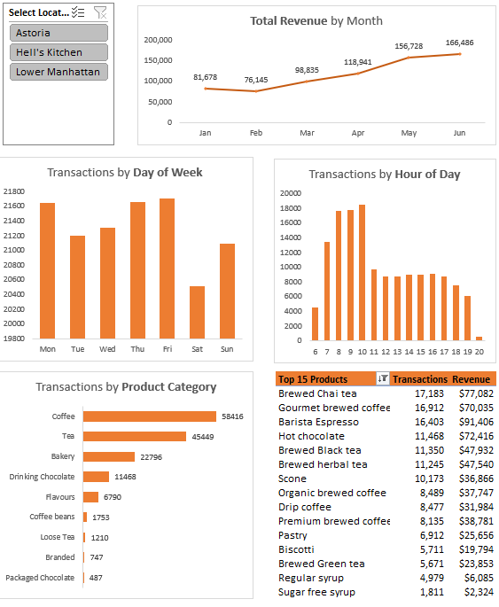

# 📊 Coffee Shop Sales Dashboard

**Coffee Shop Sales - Project Dashboard.xlsx**

This project contains an Excel dashboard analyzing coffee shop sales data. It provides insights into sales trends, product performance, and customer behavior, supporting data-driven decisions for coffee shop management.

---

## ✅ Features

- Interactive dashboard built in Excel
- Charts visualizing:
  - Total sales over time
  - Top-selling products
  - Sales by category
  - Regional performance
- Slicers and filters for dynamic analysis
- Clean, user-friendly layout

---

## 📈 Insights

*(Example text below — adjust based on YOUR dashboard’s actual findings!)*

- **Best-selling product:** Brewed Chai Tea, $77,082 in Revenue.
- **Top sales month:** June saw the highest sales, new business still growing.
- **Key trend:** New coffee shop developing a good following and growing customer base.

---

## 🛠️ Tools Used

- Microsoft Excel
  - Pivot Tables
  - Pivot Charts
  - Slicers
  - Conditional formatting

---

## 📂 File

- [Coffee-Shop-Sales-Project-Dashboard.xlsx](Coffee-Shop-Sales-Project-Dashboard.xlsx)

---

## 🔗 How to Use

- Download or clone this repository.
- Open the Excel file.
- Use slicers or filters to explore sales data interactively.
